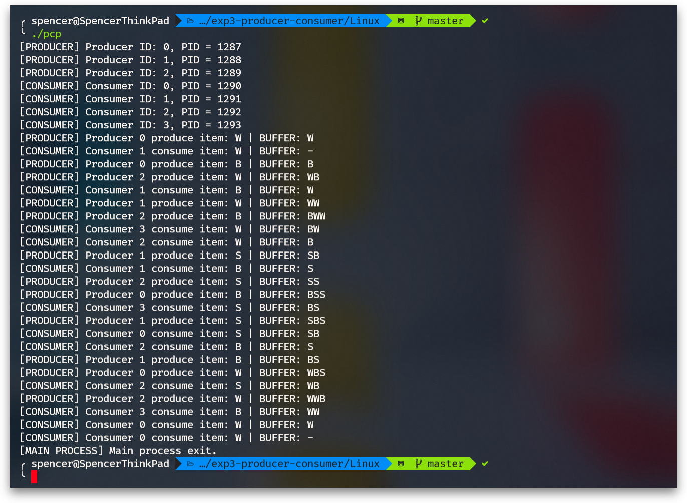
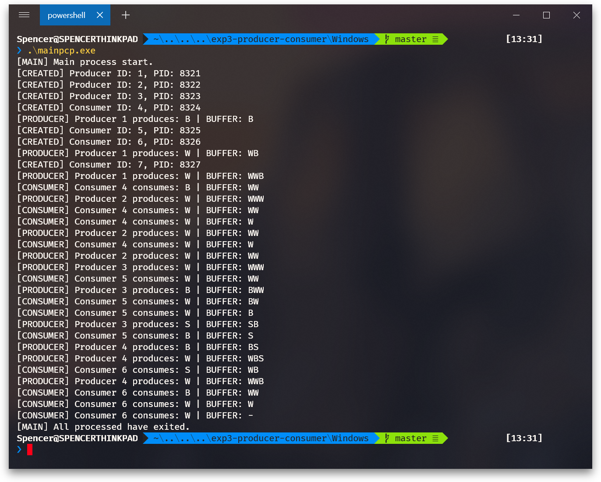

# The Producer-Consumer Problem

>【操作系统课程设计】实验三、生产者消费者问题

## 实验要求

1. 在 Windows 和 Linux 系统下通过进程编程模拟生产者消费者算法

2. 设计一个大小为 4 的缓冲区，初始为 "-"，表示空

3. 创建 3 个生产者，每个生产者

   * 随机等待一段 3 秒以内（含 3 秒）的时间，向缓冲区随机添加一个姓名首字母（大写），如王全玉的首字母为 W、Q、Y，即每次从这三个字母中取一个；

   * 若缓冲区已满，等待消费者取走字母后再添加；

   * 重复 4 次；

4. 创建 4 个消费者，每个消费者

   * 随机等待一段时间，从缓冲区读取字母

   * 若缓冲区为空，等待生产者添加字母后再读取

   * 重复 3 次

5. 需打印每次操作内容

   * 生产者打印：生产者本次写入缓冲区字母

   * 消费者打印：消费者本次取走的字母

   * 需打印缓冲区内容

   * 按先生产的商品先消费原则

## 预期输出

### Linux

  

### Windows

  

